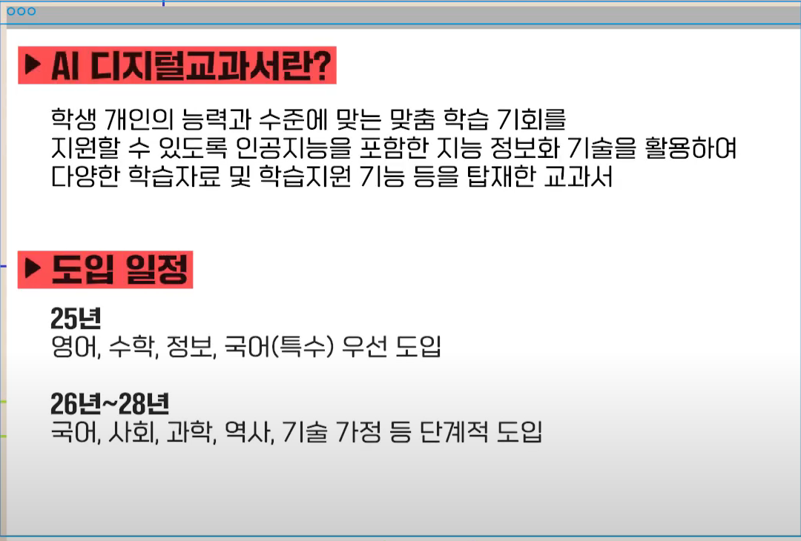
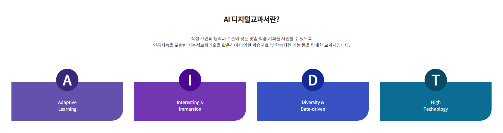
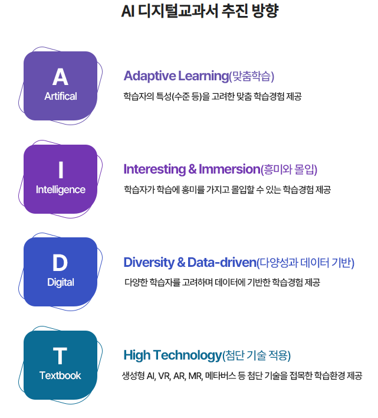

# 개념

- 학생들의 학습 현황과 강약점 파악
- 데이터 기반의 진단 결과를 바탕으로 학생별 맞춤형 수업

# 시연
[초등 영어 시연영상](https://www.keris.or.kr/main/na/ntt/selectNttInfo.do?mi=1927&nttSn=41276&bbsId=1488)
- 교사 대시보드
- AI 보조교사
- 교사의 콘텐츠 재구성

## 장점
- 수업자료 탐색 시간이 수월
- 단순 채점 시간 축소
- 교사가 쉽게 수업 설계를 할 수 있게 지원

