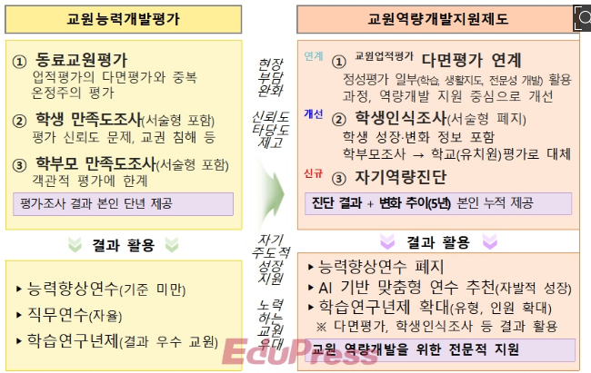

[에듀프레스](http://www.edupress.kr/news/articleList.html?page=1&total=9883&sc_section_code=&sc_sub_section_code=&sc_serial_code=&sc_area=&sc_level=&sc_article_type=&sc_view_level=&sc_sdate=&sc_edate=&sc_serial_number=&sc_word=&view_type=sm)

[한국교육 신문](https://www.hangyo.com/news/article_list_all.html?page=1)
**1117**
[수능, 사교육 도움 없이 풀 수 있게 출제](https://www.hangyo.com/news/article.html?no=103140)
```
- 난이도를 고르게 출제
- EBS 연계율 문항 수 기준 50%
```


**1028**
[천재교육 T셀파, GPT 활용한 ‘AI 실험실’ 서비스 오픈](https://www.enewstoday.co.kr/news/articleView.html?idxno=2192183)
```
AI채팅, 프롬프트, AI 독후감 첨삭
```


**1024**

[주호, AI디지털교과서 속도조절 시사 .. 과목수 축소할 듯](http://www.edupress.kr/news/articleView.html?idxno=12291)

```
- 단계적 도입을 요구. 2025년에 대한 부분은 확정이지만 2026년 이후는 정책을 반영할 예정.
- 구독료와 같은 예산적인 부분이 알려진 것과는 다르게 적은 금액일 것이라 예상.
- 2025년 초등 3,4학년, 중학교 1학년, 고등학교 1학년을 대상으로 영어, 수학, 정보과목에 도입


```

[AI DT, 향후 4년간 최대 6.6조원 필요](https://www.hangyo.com/news/article.html?no=102934)

```
향후 4년간 최대 6조원
4년간 총 구독료는 2조8353억 원~6조6156억 원(구독기간 12개월 기준)이 될 것이라고 분석

재원조달 방안에 대해서는 ▲교과서 비용 등 고등학교 무상교육 경비에 대한 국가 증액교부 특례 연장 또는 일몰 규정 삭제 ▲디지털교육혁신수요 특별교부금 한시 특례 제도 폐지(보통교부금 재원 추가 확보) ▲국고 일반회계 교육투자 유도 ▲2025년 한시적 국가시책사업 특별교부금 편성 등을 제시
```

[전국교육감협, AI디지털교과서 단계적으로 접근 제안](http://www.edupress.kr/news/articleView.html?idxno=12293)

```
- 요청사항
△시도교육청 예산이 부족하므로 특교 등 지속가능한 예산 지원,
△개인정보 보호 철저 및 보안 시스템 강화,
△AI 디지털교과서와 시도교육청 교수·학습 플랫폼의 콘텐츠 연계 등 호환성 강화, △개발된 AI 디지털교과서를 활용한 질 높은 교원 연수 실시,
△개선·보완사항 점검 후 단계적 도입, 속도 조절 필요

출처 : 에듀프레스(edupress)(http://www.edupress.kr)
```

**1021**

[세계 최대 출판사, 종이책에 AI 데이터 학습 거부 최초 표시](https://www.aitimes.com/news/articleView.html?idxno=164444)

**1017**

[수업 부담 덜고 교육효과 높이는 자료 선보여](https://www.hangyo.com/news/article.html?no=102861)

```
- 태블릿과 ai를 연결한 질문로봇을 만듦,
- 레고와 ai를 연결해 레고 스파이크 프라임을 활용한 로봇기반 steam 교육 자료를 출품.
- ‘S.O.S 안전한 용액 합성 실험 장치’, 최상오 경기 남양주다산초 교사와 허윤영 경기 장승초 교사의 ‘AI! 첫걸음! 코딩에서 AI까지!
- AI와 함께 열어가는 ESG 스마트팜 세상’을 출품한 이설희 전북 함라초 교사와 김민경 이리백제초 교사는 AI와 사물인터넷 기술을 이용해 스마트팜
- AI 챗봇 하베르 : 창의력 UP! 문해력 UP! 하브루타와 함께하는 질문하는 국어 수업
    - 미리 학습한 교과서 내용을 바탕으로 학생들의 질문에 답변한다. AI 윤리교육도 중요한 만큼 학생들의 돌발 질문에 대한 안전장치도 마련
```

**1016**

[30세 이상 성인 AI·디지털 역량 강화 지원](https://www.hangyo.com/news/article.html?no=102850)

**1015**

[AI디지털교과서 초등 수업 활용 50% 미만이 적정”](http://www.edupress.kr/news/articleView.html?idxno=12263)

```
초중고 전면 도입 > 연간 구독료 : 5조 6천억
구독 형태로 요금 책정
서책형보다 12배정도 비쌈.(월 9900원)
서채과 병행으로 비용 절감
나이스 먹통 같은 사태 우려

```

**1010**

[한국어능력시험 2배 늘리고 AI 플랫폼 구축](https://www.hangyo.com/news/article.html?no=102791)

```
응시자가 매년 증가(올해말 50만 예상)/IBT 시행 국가는 한국, 몽골, 우즈베키스탄, 인도네시아, 중국(홍콩), 필리핀으로 내년에는 루마니아, 말레이시아, 미국(괌), 베트남, 태국, 파라과이, 파키스탄이 신규로 추가/
원격감독 기능, 문항 자동생성 및 채점 기능 등을 갖춘 AI 활용 디지털 플랫폼 구축을 2026년 도입 목표로 진행> 디지털 체제 전환 완료 시 응시생이 시험장에 가지 않고도 효과적인 측정이 가능

```

**1003**

[올해부터 교원평가 폐지 2026년 교원역량개발지원제 시행](http://www.edupress.kr/news/articleView.html?idxno=12239)

```
교권침해와 실효성 문제가 제기, 다면평가, 정성평가 반영, 학습지도/ 생활 지도 역량 중시

> 기사에서 발췌한 사진
```

**1002**

[내년, 공립 중·고 교사 5천 504명을 신규 선발](http://www.edupress.kr/news/articleView.html?idxno=12233)

```
올해보다 22%정도 증가
```

[비상교육, 2022 개정 교육과정 대비 초등 교구몰 운영](http://www.edupress.kr/news/articleView.html?idxno=12232)

```
비상교육은 2021년부터 테크빌교육과 업무 협약을 맺고 초등 비바샘과 연계된 비상교육 전용 교구몰을 운영
교구상품확인, 원스톱 서비스, 전체 교구 목록 게재, 초등 비바샘에 탑재된 현장 교사 수업 연계 콘텐츠 교구판매 등 다양한 서비스가 제공
```

**1001**

[[2024 국감 이슈분석③] ‘디지털 교육혁신 특교 5300억 원’ 집행 문제 살필 듯](https://www.hangyo.com/news/article.html?no=102681)

```
6월 기준 집행률 19%에 불과

```

**0926**

[통합사회·통합과학 2028 수능 변별력 강자되나 .. 사교육 증가 우려](http://www.edupress.kr/news/articleView.html?idxno=12204)

```
선지에 여러 개념들이 통합되어 사용되고 있음. 수험생 부담을 커질 것으로 예상되고 이에 따라 사교육의 영향이 클 것이라 생각이 듦
```

**0924**

[[단독] AI디지털교과서 검정, 무더기 탈락 .. 발행사들 ‘패닉’](http://www.edupress.kr/news/articleView.html?idxno=12195)

```
C사, y사 석권. 독과점 우려. 초등수학 합격률 25%
```

**0923**

- [에듀테크 코리아 페어](https://www.hangyo.com/news/article.html?no=102631)

```
천재교과서 스폰서데이
```

**0913**

- [호주 학생 3명 중 1명, 수리·문해력 기준 미달](https://www.hangyo.com/news/article.html?no=102609)

```
호주 학생 3명 중 1명의 수리 능력과 문해력 수준이 기준에 못 미치는 것으로 나타남. 원주민 아동과 시골 지역의 아동들의 학습수준이 많이 떨어짐.
```

**0912**

- [고교학점제로 교사 주 64시간 이상 근무](https://www.hangyo.com/news/article.html?no=102595)

```
경기도내에서 고교학점제를 경험한 고교교사들은 업무량과 난이도 높아졌다 평가. -> 학생 감축과 교사 증원이 우선이라는 의견
```

**0910**

- [‘교육 핵심과제’ 아직 선진국 못 미쳐](https://www.hangyo.com/news/article.html?no=102570)

```
학급당 학생 수, 초임교사 급여가 OECD 평균에 못 미침. 영국 등 복선형 임금체계를 갖추고 있고, 최고호봉 도달 기간은 우리나라가 10년이상 늦는 등의 차이점을 잘 봐야 한다.
```

- [[집단면접] 집단면접 알고리즘 분석](https://www.hangyo.com/news/article.html?no=102519)

```
심층면접은 개인의 인성과 업무와 관련된 지식을 평가, 집단면접은 소통하는 능력과 관계성을 통한 문제해결력을 평가
```

**0905**

- [[박남기의 교단춘추] 수업 중 생성 AI 활용은 보수적으로](https://www.hangyo.com/news/article.html?no=102511)

```
생성형 ai는 수업 제공의 입장에서는 편리하지만 과제를 대신하거나 자소서를 쓰는 등 학생의 역량을 요구하는 부분에서는 부정적인 영향. 미국의 절반에 가까운 교육구에서는 학교 기기놔 네트워크에서 LLM에 대한 접근 차단.
옹호의 입장은 다양한 주제에 대해 즉각적인 학습 파트너 역할 가능
AI를 활용하여 수업하는 경우와 그렇지 않은 경우의 교육적 성장 결과 비교 분석, 학생 특성별 효과 비교 분석 등등 많은 연구
```

- [[중등 수학] 수학적 모델링 문제해결을 통해 수학의 유용성 경험하기](https://www.hangyo.com/news/article.html?no=102514)

```
수학적 모델링은 수학을 사용하여 표현하고 분석하고 예측하거나, 실세계 현상에 통찰력을 제공하는 과정
```

**0903**

- [한글은 우수하다는데 왜 한국어가 어려운가](https://www.hangyo.com/news/article.html?no=102423)

```
컴퓨터에서 한글처리와 한국어 처리는 다른 문제. 한글 속에 숨은 뜻을 찾는다?
```

**0902**

- [[AIDT 돋보기] AI 디지털교과서에 관한 우려 세 가지](https://www.hangyo.com/news/article.html?no=102462)

```
우려? 교과서가 사라진다, 교사가 사라진다, 인공지능 기술이 포함되지 않는다
```
**0831**
[천재교육·천재교과서, 초중고 155종 220책 검인정 교과서 최다 합격](https://www.hankyung.com/article/2024083081277)
```
▲초등 7과목 12종, ▲중학 20과목 24종, ▲고등 115과목 119종으로 총 142과목 155종의 검인정 교과서가 합격하는 쾌거
-> 쉽고 재미있고 학습부담이 적은 교과서
```

**0825**

- [수능 9월 모평 졸업생 비중 역대 두번째](https://www.hangyo.com/news/article.html?no=102442)

```
의대 증원에 따라 상위권 성적이 도전하는 것으로 예상.
```

**0822**

- [선넘은 학부모 고소](https://www.hangyo.com/news/article.html?no=102416)

```
부산, 통학버스를 초등학교 안까지 들여보내달라는 요구, 이를 고소까지

```

**0820**

- [교총 “유‧초‧중등 예산 감축 우려”](https://www.hangyo.com/news/article.html?no=102403)

```
기간제교사 비율이 높다? ->
기술은 발전하지만 디지털문해력이 낮다
기초학력보장
학교폭력문제
```

- 요약 : 교부금이란 국가 또는 시, 도가 스스로 행해야 할 사무를 시, 도 또는 시, 군, 자치구에게 위임하여 수행할 경우에 사업수행에 필요한 경비를 지불하는 재원. 이것이 어린이집까지 확대되면 지금까지 사용하던 예산이 줄어드는 효과, 즉 문제는 많지만 예산이 줄어들 수 있는 상황, 현재는 오히려 늘려야하는 상황 - 교육 환경이 열악하다

**0819**

- [뉴질랜드 초등 연 2회 성취도 평가](https://www.hangyo.com/news/article.html?no=102385)

```
초중고 휴대전화 전면 금지
문해력 저하에 대한 대비책
```

- [생성형 AI 시대 무엇을 준비해야 하나](https://www.hangyo.com/news/article.html?no=102380)

```
- 수업에 AI를 녹인다? 국어 교과에 ai활용보고서쓰기
- 교사의 역량 강화
- 학생들의 비판적 사고 -> 문해력
=> 뜬구름 잡는 이야기, 사실상 해결책이 아님
```

- [교원 선발 규모 늘려야 하는 이유](https://www.hangyo.com/news/article.html?no=102381)

```
- 늘봄, 중등 결원 문제 외에 학생 맞춤 교육 및 AI 디지털교과서 도입을 위한 학급당 학생 수 20명 이하 감축
- 2023년 교육통계연보에 따르면 초·중·일반고 22만895학급 중 학급당 학생 수 21명 이상인 학급 수가 73.5%

```

**0607**

- [[기획:AI와 교육] ②AI를 활용한 교육은 무엇이 준비되고 있나](https://www.aitimes.com/news/articleView.html?idxno=160389)
