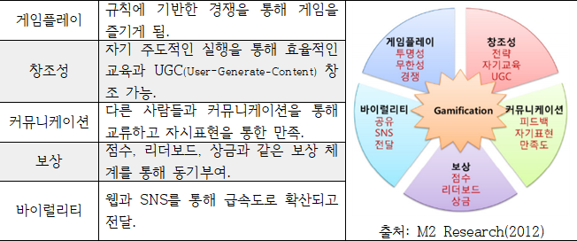
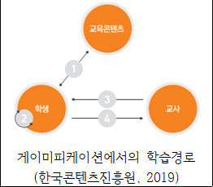
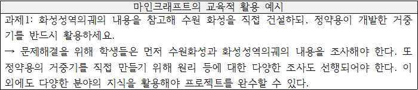

### [위키독스](https://wikidocs.net/120660)

# 01. 게이미피케이션
## 정의 
### 게임적인 사고와 기법을 활용해 유저를 몰입시키고 문제를 해결하는 과정

## 특징

1. **게임플레이**
2. **창조성**
3. **커뮤니케이션**
4. **보상**
5. **바이럴리티(Virality)**

### 작동원리
- **게임 매커니즘**: 동기유발, 재미, 피드백과 보상으로 구성.

### 학습자 핵심 역량과의 연결
게이미피케이션은 2015 개정 교육과정이 요구하는 학습자 핵심역량을 강화할 가능성이 있습니다:
- **자기관리 역량** ↔ 게임플레이
- **창의적 사고 역량** ↔ 창조성
- **의사소통 역량** ↔ 커뮤니케이션
- **지식정보처리 역량** ↔ 보상
- **공동체 및 심미적 감성 역량** ↔ 바이럴리티

## 교육 게이미피케이션

- 명확하고 도전할만한 미션
- 공정하고 빠르게 지급되는 포인트
- 유저가 좋아하는 시기적절한 보상

### 분류
- SW게임, 보드게임, 빅게임

### 교육 게이미피케이션의 효과

#### 기존 학습 방식의 변화
- 전통적 방식: **교육콘텐츠 → 교사 → 학생**
- 게이미피케이션 활용: 학습자가 교육콘텐츠로부터 직접 지식을 얻고, 동료와 소통하며 협업하는 방법 학습.

#### 구체적 효과
- 학습자를 위한 **작은 단위의 실현 가능한 과제** 제시.
- 빠른 성과 평가와 피드백 제공.
- 명확한 미션과 적절한 보상을 통해 즐거운 학습 환경 조성.

## AI와 교육 게이미피케이션

### 마인크래프트 사례

### 기존의 교육 게이미피케이션
- 미션 -> 피드백 -> 보상
- 불필요한 경쟁 심리를 불러일으킴. -> 빠른 평가와 구체적인 피드백이 필요함.

---

# 02. 디지털리터러시
## 사전적 의미
- 글을 읽고 쓸 줄 아는 능력
## 포괄적 의미
- 자신이 원하는 지식이나 정보를 식별하여 활용할 수 있는 능력
## 디지털리터러시
- 컴퓨터를 활용하여 여러가지 출처로부터 찾은 다양한 형태의 정보를 이해하고 자신의 목접에 부합하는 새로운 정보로 조합함으로써 올바르게 사용하는 능력

---

# 03. 역동적 평가
- **역동적 평가**: 학습 결과보다는 **학습 과정**에 초점을 맞추며, 평가자와 학습자 간 **상호작용**을 포함하는 평가 방식.
  - **정적 평가(Static Assessment)**: 이미 이루어진 발달에 대한 **회고적 평가**.
  - **역동적 평가**: **진행 중인 발달 과정**과 학습자가 미래에 나타낼 가능성을 평가.

---

## 평가 접근 방식
1. **표준화된 접근**:
   - **평가 절차**: 검사 → 훈련 → 재검사.
   - 학습자와 평가자 간 **구조화된 상호작용**을 통해 **양적 데이터**를 산출.
   - **특징**:
     - 학습자가 특정 과제를 성공하기 위해 필요한 도움의 양을 평가.
     - 전통적인 심리측정적 성격을 가짐.

2. **임상적 접근**:
   - **예시**: 학습잠재력 평가도구(LPAD).
   - 학습자와 검사자 간 **비표준화된 상호작용**과 **융통성**을 강조.
   - **특징**:
     - 학습 과정에 대한 질적 정보를 제공.
     - 개별 학습자의 역동과 발달 상황에 민감.

---

## 역동적 평가 접근의 문제와 개선점

1. **평가 점수의 수량화 및 해석상의 문제**:
   - 표준화된 접근: 점수를 정적인 의미로 해석 시 IQ 검사처럼 오용 가능.
   - 임상적 접근: 결과를 수량화하기 어려움 → 기초선 평가 필요.

2. **평가자 훈련 및 평가 실시에 관련된 문제**:
   - 임상적 접근에서는 숙련된 평가자의 자질 요구.
   - 평가자의 훈련에는 **비용과 시간**이 소요.

3. **신뢰도, 타당도 문제**:
   - 역동적 평가 도구는 변화에 민감해야 함.
   - 준거 타당도 확보 및 이론적 개념의 경험적 타당화 필요.

---

## 인공지능을 활용한 역동적 평가의 방향

- **4차 산업혁명 시대의 평가 패러다임**:
  - 암기 지식 측정에서 **심층 학습(deep learning)**으로 전환.
  - 단순 암기 능력 측정은 비효율적.

- **인공지능 활용 방향**:
  1. **시각적 표상(visual representation)** 평가 도입.
  2. 단답-서술형 응답 대신 **실제 수행 평가** 활용.
  3. **실시간 피드백** 및 과정 중심 평가 구현.

- **미래 전망**:
  - 인공지능 기반 평가의 연구가 활발하며, 평가 패러다임을 변화시키고 있음.

---

## 참고문헌

- 한순미(2008), 개별화 교수-학습에서의 평가 방안: 역동적 평가를 중심으로, 교육방법학회, 20(1), 49~73.
- 곽현석, 강옥려, 김경성(2016), 역동적 평가(Dynamic Assessment)의 연구동향 분석, 한국초등교육, 27(2), 1~18.
- 이경건, 하민수(2020), 인공지능 기반 자동평가의 현재와 미래: 서술형 문항에 관한 문헌 고찰과 그 너머. 교육공학학회, 36(2), 353~382.