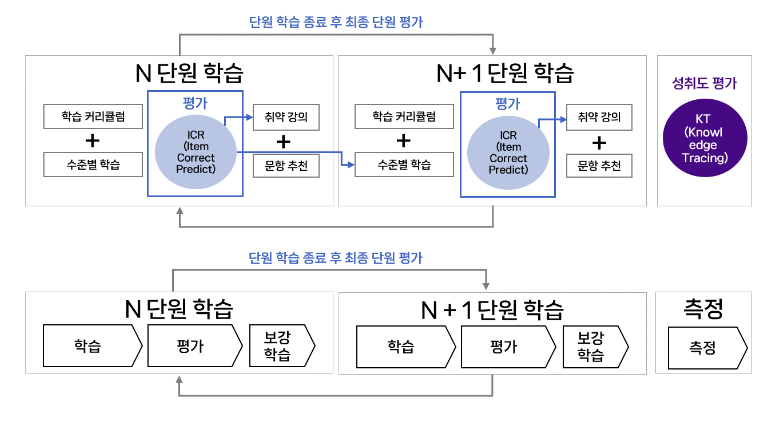

- 밀크T Genia.: 천재교육의 42년 교육 전문 노하우와 기술력이 만들어낸 인공지능 AI기술 집약체
- 특징
    - 학생 한명 한명의 실력을 진단하고 점검하여 1:1 맞춤학습을 추천
    - 진단, 맞춤학습 제공, 점검의 프로세스.

- 개발 활용
    - 

- AI맞춤학습 프로세스

    

    - 학습, 평가, 보강의 과정을 반복하여 학습을 마무리하면 종합 측정을 통해 회원의 성취 기준을 다시 측정하여 필요한 학습을 진행하는 일련의 과정을 반복

- Knowledge Tracing
    - 학생(user)의 풀이 이력을 활용하여 학생이 미래에 각 문제에 대해 잘 풀어낼 확률을 도출하는 것으로 이를 ‘활용하여 학생의 지식 상태를 추적
    -  DKT는 RNN(Recurrent Neural Networks) 모델의 형태를 가지고 있습니다. RNN은 시간 순차적 데이터를 학습하는 데 특화된 순환적 구조를 갖는 것이 특징입니다. DKT는 RNN의 일종인 LSTM(Long Short-Term Memory models)
