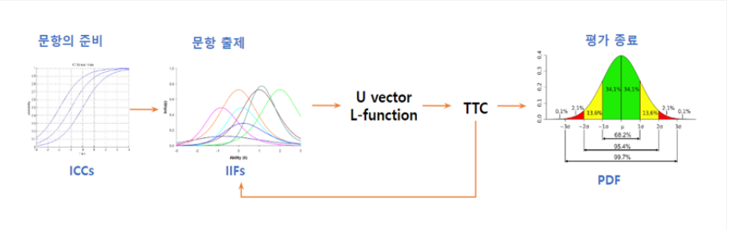

# 밀크티 ai 서비스에 대한 요약
### 모든 자료 및 사진은 https://i.milkt.co.kr/Genia/frm_AiGeniA_Technique.aspx에서 발췌했습니다.
### 학습의 목적 이외에 어떠한 목적으로도 사용하지 않았습니다.

- 밀크T Genia.: 천재교육의 42년 교육 전문 노하우와 기술력이 만들어낸 인공지능 AI기술 집약체
- 특징
    - 학생 한명 한명의 실력을 진단하고 점검하여 1:1 맞춤학습을 추천
    - 진단, 맞춤학습 제공, 점검의 프로세스.

- 개발 활용
    - 

- AI맞춤학습 프로세스

    

    - 학습, 평가, 보강의 과정을 반복하여 학습을 마무리하면 종합 측정을 통해 회원의 성취 기준을 다시 측정하여 필요한 학습을 진행하는 일련의 과정을 반복

- Knowledge Tracing > 특정 학생의 지난 교육 기록을 활용해 아직 풀지 않은 문제에 대한 정오답을 예측하는 task
    - 학생(user)의 풀이 이력을 활용하여 학생이 미래에 각 문제에 대해 잘 풀어낼 확률을 도출하는 것으로 이를 활용하여 학생의 지식 상태를 추적. 숙련도로 이를 나타내는 척도로 사용
    - BKT, DKT 등의 모델이 사용.[참고링크](https://medium.com/riiid-teamblog-kr/%EA%B5%90%EC%9C%A1ai%EC%9D%98-%EA%B8%B0%EB%B3%B8%EC%9D%B4%EC%9E%90-%EC%8B%9C%EC%9E%91-deep-knowledge-tracing-dkt-8bc132eda9ec)

    - DKT는 RNN(Recurrent Neural Networks) 모델의 형태를 가지고 있습니다. RNN은 시간 순차적 데이터를 학습하는 데 특화된 순환적 구조를 갖는 것이 특징입니다. DKT는 RNN의 일종인 LSTM(Long Short-Term Memory models)
        )
    - 현재 KT 에서 사용하는 모델(최신화)

- ICP
    - AI 기반 개인화 추천 기술은 학습자가 학습한 이력을 바탕으로 학습 정도를 추정하고, 학습자에게 적합한 내용과 방법을 추천하는 기술
    - 알고리즘
        - CBF, CF, MF
        - 정오답 확률을 예측할 수 있는 알고리즘은 MF. 하지만 부가정보를 활용할 수 없기에 FM도 많이 사용

- IRT
    - 피험자들이 평가문항에 대한 응답을 근거하여 피험자의 특성이나 평가 문항의 난이도 변별도를 측정하기 위한 검사 이론. 
    - 특징 : 개인의 능력이나 문항의 난이도 같은 모수를 평가 문항에의 정오(正誤)와 같은 이산적인 결과를 확률론적으로 판단하여 구한다는 점
    - 고전검사이론 : 정답률에 의해 평가 문항이 분석
        >시험에 응시한 학생의 시험 결과 자료를 이용하여 문항 난이도를 계산하는 방식으로써 동일한 문항이라도 응시생 집단의 능력 수준에 따라 문항의 난이도가 상대적으로 측정되는 한계가 있을 수 있음

    - 문항반응이론 : 확률적 모형식을 통해 문항 모수 및 학생 능력 수준의 추정이 이루어짐.
        >응시생 집단의 특성에 영향을 받지 않기 때문에 고유한 문항 난이도와 변별도 및 학생의 능력을 산출할 수 있는 특징
- CAT
    - 개별 학생이 문항을 푸는 추이에 따라 맞춤형으로 다음 문항을 제시하고 측정하는 시험 방식
    - 동일한 시험지로 측정하는 CT와는 다르게 시험의 공정성이 증가하는 장점
        

- 빅데이터 및 ML/DL

- 유사도 기반 학습 챗봇
    - Word2Vec : 단어를 벡터로 바꿔주는 알고리즘
    - 비슷한 위치에서 등장하는 단어들은 비슷한 의미를 가진다

- 손글씨 인식
    - CNN 모델

- OCR

- AUTO ENCODER
    - 비지도 (unsupervised) 방식으로 훈련된 인공 신경망
    - 먼저 데이터에 인코딩된 표현을 학습한 다음, 학습된 인코딩 표현에서 입력 데이터를 (가능한 한 가깝게) 생성하는 것을 목표

- STT
